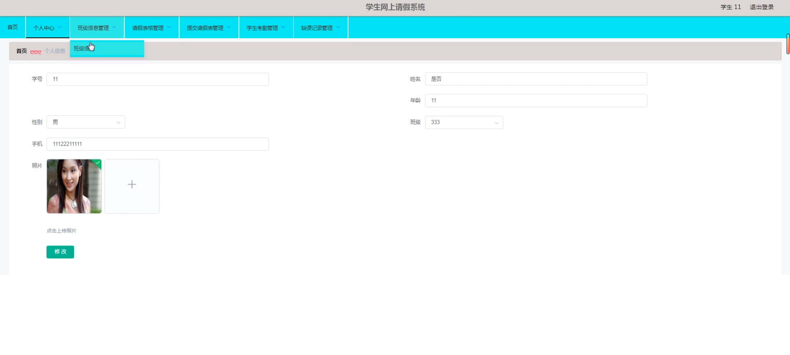
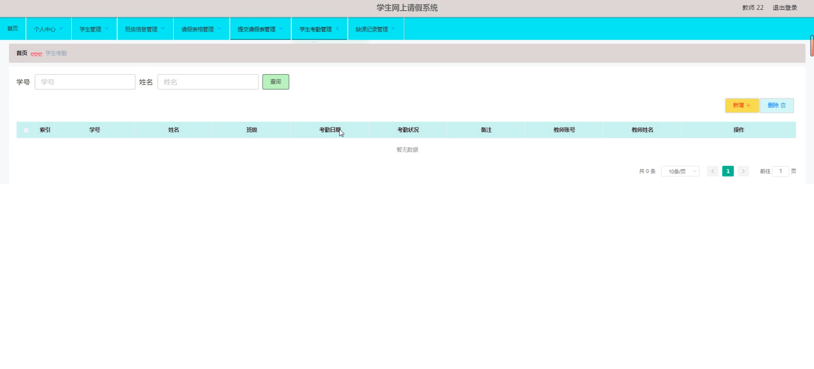

# 基于springboot的学生网上请假系统

---
### 👉作者QQ ：1556708905 微信：zheng0123Long (支持定制修改、部署调试、定制毕设)

### 👉接网站建设、小程序、H5、APP、各种系统等

---

#### 介绍

基于SpringBoot的学生网上请假系统旨在为学校的管理人员、教师和学生提供一个便捷、高效的请假管理平台。系统通过信息化手段，实现了请假流程的线上化，简化了传统的请假审批流程，提升了请假管理的透明度和效率。系统分为管理端、教师端和学生端，分别为不同的角色提供相应的功能模块。

#### 技术栈

后端技术栈：Springboot+Mysql+Maven

前端技术栈：Vue+Html+Css+Javascript+ElementUI

开发工具：Idea+Vscode+Navicate

#### 系统功能介绍

管理端功能模块  
个人中心：管理员可以管理个人信息，修改密码等。  
学生管理：管理学生的基本信息，包括添加、删除和更新学生信息。  
教师管理：管理教师的基本信息，包括添加、删除和更新教师信息。  
班级信息管理：管理班级的基本信息，包括班级名称、班主任、班级学生等信息。  
请假表格管理：管理员可以查看、审核和管理所有学生的请假申请表格。  
提交请假表管理：管理员可以提交请假表格，并进行审核和批准。  
学生考勤管理：管理员可以查看和管理学生的考勤记录，了解学生的出勤情况。  
缺课记录管理：管理员可以查看和管理学生的缺课记录，并进行统计和分析。  

教师端功能模块  
个人中心：教师可以管理个人信息，修改密码等。  
学生管理：教师可以查看和管理班级内学生的基本信息。  
班级信息管理：教师可以查看和管理自己所负责的班级信息。  
请假表格管理：教师可以查看、审核和管理班级学生的请假申请表格。  
提交请假表管理：教师可以提交学生的请假表格，并进行审核和批准。  
学生考勤管理：教师可以查看和管理班级学生的考勤记录，了解学生的出勤情况。  
缺课记录管理：教师可以查看和管理班级学生的缺课记录，并进行统计和分析。  

学生端功能模块  
个人中心：学生可以管理个人信息，修改密码等。  
班级信息管理：学生可以查看自己所在班级的基本信息。  
请假表格管理：学生可以填写和提交请假申请表格。  
提交请假表管理：学生可以提交自己的请假表格，并查看审核状态。  
学生考勤管理：学生可以查看自己的考勤记录，了解自己的出勤情况。  
缺课记录管理：学生可以查看自己的缺课记录，并进行统计和分析。  

#### 系统作用

简化请假流程：系统将传统的请假流程线上化，减少了纸质文件的使用，提高了请假申请和审批的效率。  
提高管理效率：通过信息化管理，管理员和教师可以更加高效地管理学生的请假和考勤记录。  
增强透明度：系统提供了实时的请假和考勤信息，学生可以随时查看自己的请假申请状态和考勤记录，增强了管理的透明度。  
数据统计和分析：系统可以对学生的请假和考勤数据进行统计和分析，帮助学校更好地了解学生的出勤情况，及时发现和解决问题。  

#### 系统功能截图

代码结构

数据库表

登录

个人中心

班级信息管理

学生管理

教师管理

教师端请假表格管理

提交请假表管理

学生端个人信息

学生考勤管理

缺课记录管理

#### 总结

基于SpringBoot的学生网上请假系统为学校的请假管理提供了一个高效、便捷的信息化平台。通过分角色的功能模块设计，满足了不同用户的需求，实现了请假流程的线上化和自动化，提高了管理的效率和透明度。系统不仅简化了请假申请和审批流程，还提供了强大的数据统计和分析功能，为学校的学生管理工作提供了有力支持。

#### 使用说明

创建数据库，执行数据库脚本 修改jdbc数据库连接参数 下载安装maven依赖jar 启动idea中的springboot项目

后台地址：http://localhost:8080/springboot0e3m2/admin/dist/index.html

管理员  abo 密码 abo

